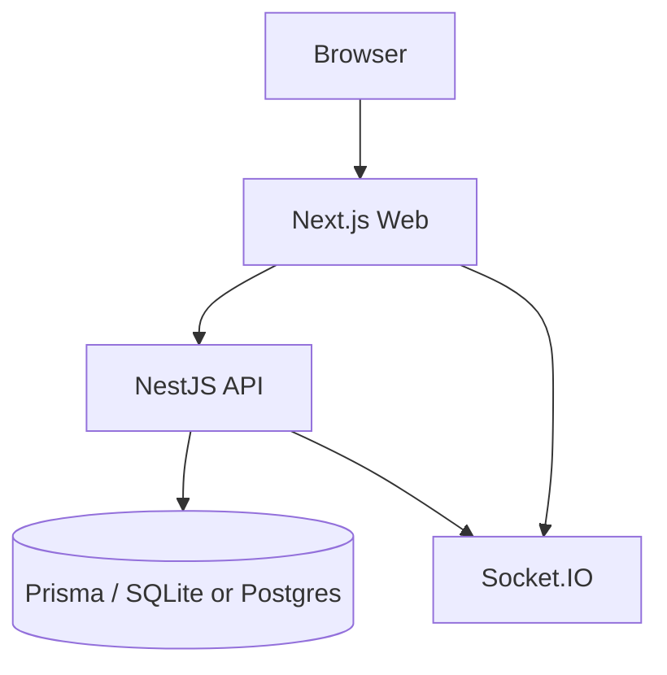

# Last Shelter

Мультиплеерная web-игра: ведущий создаёт комнату, игроки входят по коду, раскрывают характеристики и голосуют за место в убежище.

## Стек

- **Web:** Next.js 16 (App Router) + TypeScript + Tailwind + shadcn/ui
- **API:** NestJS + Prisma + SQLite (локально) / Postgres (прод)
- **Realtime:** Socket.IO
- **Auth:** anonymous JWT (без регистрации)

## Архитектура



Подробнее: [docs/architecture.md](docs/architecture.md), [docs/database.md](docs/database.md), [docs/game-flow.md](docs/game-flow.md).

## Локальный запуск (без Docker)

```bash
# 1. API
cd api
cp .env.example .env   # если нужно
npm install
npm run db:setup
npm run start:dev

# 2. Web (другой терминал)
cd ..
cp .env.example .env.local
npm install
npm run dev
```

- Web: http://localhost:3000  
- API: http://localhost:4000  

## Docker

### Разработка (hot reload) — так и смотри UI-правки

Обычный `docker compose up` собирает **production**-образ: код запекается при билде и **не** обновляется при сохранении файлов. Для ежедневной работы используй dev-стек:

```bash
npm run docker:dev
# или в фоне:
npm run docker:dev:d
npm run docker:logs
```

Сохранил файл → Next/Nest подхватывают сами → обнови страницу (часто HMR сам). Пересобирать образ не нужно.

### Production-like (без hot reload)

```bash
docker compose up --build
# или
npm run docker:up
```

Остановить оба варианта: `npm run docker:down`

- Web: http://localhost:3000  
- API: http://localhost:4000  

Опционально в `.env` рядом с compose:

```env
JWT_SECRET=change-me
WEB_ORIGIN=http://localhost:3000
NEXT_PUBLIC_API_URL=http://localhost:4000
```

База API хранится в Docker volume `api-data`.

## Environment

Web (`.env.local`):

```env
NEXT_PUBLIC_API_URL=http://localhost:4000
```

API (`api/.env`):

```env
DATABASE_URL="file:./dev.db"
JWT_SECRET="change-me"
PORT=4000
WEB_ORIGIN="http://localhost:3000"
ENABLE_MOCK_BOTS=true
```

Solo-тест с ботами: [docs/mock-flow.md](docs/mock-flow.md). На prod compose моки по умолчанию выключены (`ENABLE_MOCK_BOTS=false`).

Для Postgres замените `DATABASE_URL` и `provider` в `api/prisma/schema.prisma`.

## Тесты

```bash
npm run test
npm run lint
npm run typecheck
npm run build
npm --prefix api run build
```

## Деплой

- Web → Vercel (`NEXT_PUBLIC_API_URL` на URL API)
- API → Railway / Render / Fly.io
- БД → Neon / Supabase Postgres / другой Postgres

## Правила игры

1. Ведущий создаёт комнату и делится кодом.
2. Игроки входят с именем.
3. Старт выдаёт катастрофу, убежище и персонажей.
4. Раунды: раскрытие → обсуждение → голосование.
5. При ничьей — переголосование.
6. Финал, когда активных игроков = вместимость убежища.

## Ограничения MVP

- SQLite удобен локально, для продакшена лучше Postgres.
- Нужны два процесса (web + api).
- Нет чата / платежей / полноценной регистрации.
# shelter
