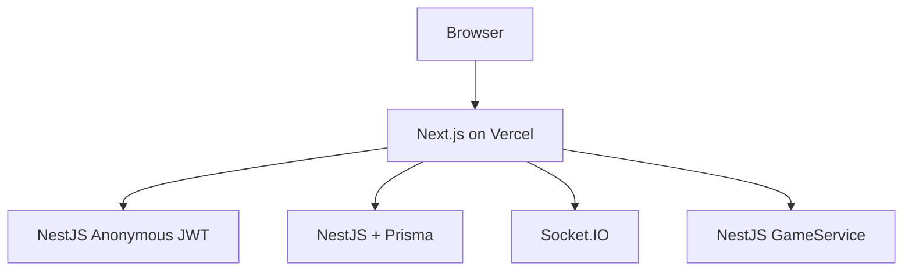

# Architecture

## Layers

1. **UI** — Next.js App Router + feature components
2. **Client API** — `src/lib/api` + `api-commands`
3. **Realtime** — `useRoomChannel` via Socket.IO
4. **Backend** — NestJS modules (`auth`, `game`, `realtime`, `prisma`)
5. **Persistence** — Prisma schema + transactions in `GameService`

## Auth

- `POST /api/auth/anonymous` выдаёт JWT
- Токен хранится в `localStorage` (`ls_token`)
- Все игровые запросы и сокеты требуют Bearer token
- Игрок определяется по `userId` из JWT, не по client-supplied playerId
