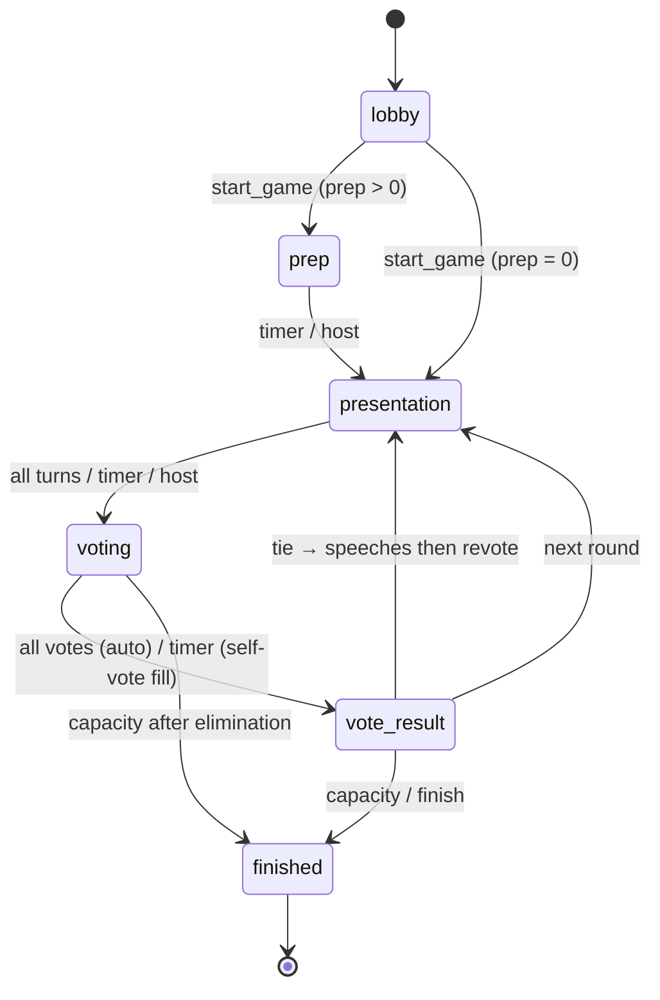

# Game flow

## Lobby settings

При создании комнаты:

- **Стратегия раскрытия** — *форма* раздачи квоты на раунды (не фиксированная длина партии):
  - `classic` — почти ровно, лёгкий уклон в начало
  - `slow` — максимально ровно
  - `sprint` — больше карт в первых раундах
- **Ознакомление** (`prep_duration_sec`, 0–180) — пауза после раздачи карт до первого хода (0 = сразу в очередь).

## Length scales with lobby

Вместимость ≈ половина лобби. **Число раундов голосования** = `игроки − вместимость` (обычно **1 исключение за раунд**).

| Игроки | Места | Раундов | Пример плана (classic) |
|--------|-------|---------|-------------------------|
| 4 | 2 | 2 | 4 → 3 |
| 8 | 4 | 4 | 2 → 2 → 2 → 1 |
| 12 | 6 | 6 | 2 → 1 → 1 → 1 → 1 → 1 |

7 добровольных раскрытий (одна категория всегда скрыта) **размазываются** на эти раунды. Большое лобби → длиннее партия.

При ничьей: переголосование на то же число мест (`seats_needed`), обычно 1.

## Round loop

1. **Prep** (опционально) — все видят своё досье, катастрофу и убежище. Раскрывать нельзя.
2. **Ход игрока (presentation)** — очередь активных. На своём ходе: раскрытие по квоте раунда + речь + спецкарта.
3. **Voting** — голос за другого; обычно уходит один. Когда все проголосовали — итог сразу; таймаут → автоголос за оставшихся.
4. **Vote result** — автопереход; ведущий может ускорить.

## Finale stats

Порог катастрофы vs готовность команды: ≥ порога → **пройдено**, иначе **провалено**.
