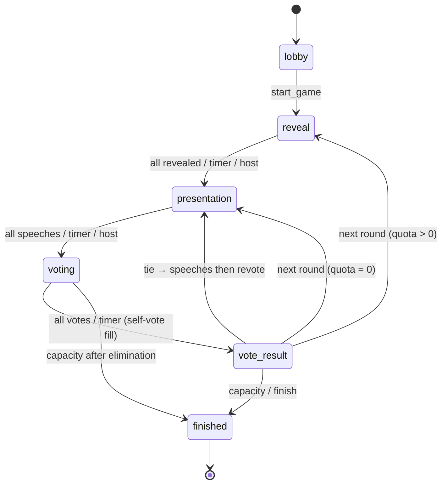

# Game flow

## Round loop

1. **Reveal** — квота по раундам: **3 → 2 → 2**, дальше без новых раскрытий. Одна характеристика всегда остаётся скрытой до исключения / финала.
2. **Presentation** — у каждого активного игрока таймер речи (настраивается при создании, 1–3 мин). Общего обсуждения нет. На ничьей — снова речи всех, затем переголосование.
3. **Voting** — голос за другого кандидата. По истечении таймера непроголосовавшие автоматически голосуют **за себя**. После речей ведущий может начать голосование или сразу перейти к следующему раунду (`next-round`) без исключения — в том числе в 1-м раунде.
4. **Vote result** — автопереход по таймеру; ведущий может ускорить вручную.

## Timers & pause

- Переходы фаз идут автоматически по `phase_ends_at`.
- Ведущий может поставить игру на паузу (`pausedAt`) — таймеры останавливаются у всех.

## Host powers

Старт, пауза/продолжить, ручной переход к речам / следующему оратору / голосованию / следующему раунду, финиш, удаление из лобби.

## Player powers

Вход, раскрытие своих характеристик (в рамках квоты), **карточка действия** (одноразовая: обмен / пересдача / принудительное раскрытие — на фазах reveal и presentation), речь по очереди, голосование.

## Trait rarity

Редкости (как в TCG): **common → uncommon → rare → epic → legendary → mythic**.  
Визуал: символ-гем + текстура/«фольга» поверхности + состояние открыто/скрыто. Цвет категории сознательно приглушён, чтобы не шуметь.  
Раздача: weighted pick (мифические реже). Legacy `unique` читается как `mythic`.

## Finale stats

При `finished` снимок отдаёт `finish_stats`: индекс выживания по раундам, голосам против и силе редкости руки. Это атмосферный отчёт, не честная вероятность.
